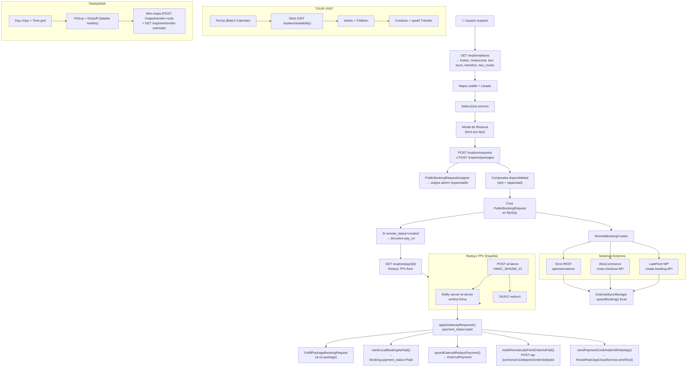

# /explore — Análisis Completo de Infraestructura

> Extraído: 2026-06-30 | Fuente: código fuente real del proyecto

---

## 1. Rutas

### Explore
```
GET  /explore                    → PublicExploreController@index          (public.explore)
GET  /explore/places             → PublicExploreController@places          (public.explore.places)
GET  /explore/availability       → PublicExploreController@availability    (public.explore.availability)
GET  /explore/transfer-estimate  → PublicExploreController@transferEstimate (public.explore.transfer-estimate)
POST /explore/requests           → PublicExploreController@storeBookingRequest  (public.explore.requests.store)
POST /explore/packages           → PublicExploreController@storePackageBookingRequest (public.explore.packages.store)
```

### Mapas
```
GET  /maps/select-address        → MapController@selectAddress
GET  /maps/taxi-route            → MapController@taxiRoute
POST /maps/places                → MapController@searchPlaces
POST /maps/route                 → MapController@getRoute
POST /maps/geocode               → MapController@geocodeAddress
POST /maps/reverse-geocode       → MapController@reverseGeocode
POST /maps/transfer-route        → MapController@transferRoute
```

### Pagos Redsys (desde /explore)
```
GET  /explore/pay/{request}      → PublicRedsysPaymentController@start  (public.redsys.start)
POST /payments/redsys/notify     → PublicRedsysPaymentController@notify (public.redsys.notify)
GET  /payments/redsys/ok/{request} → PublicRedsysPaymentController@ok   (public.redsys.ok)
GET  /payments/redsys/ko/{request} → PublicRedsysPaymentController@ko   (public.redsys.ko)
```

### Checkout Taxi (legacy WhatsApp → WooCommerce)
```
GET  /taxi-routes/checkout/{token} → PublicTaxiRouteCheckoutController@show
```

---

## 2. Tipos de Servicio en /explore

| Tipo frontend | Tipo booking | Descripción |
|---------------|-------------|-------------|
| `hotel` | `hotel` | Hotel con habitaciones |
| `restaurant` | `restaurant` | Restaurante con mesas |
| `taxi` | `taxi` | Servicio de taxi directo |
| `tour_visit` | `tour` | Tour/visita (LatePoint) |
| `taxi_route` | `tour` (→ `transfer`) | Ruta taxi (WooCommerce) |
| `transfer` | `tour` (→ `transfer`) | Transfer hotel/villa |

---

## 3. Modelos Involucrados

### PublicBookingRequest — modelo central

**Tabla:** `public_booking_requests`

| Campo | Tipo | Descripción |
|-------|------|-------------|
| `id` | bigint | PK |
| `request_reference` | string unique | REQ-yymmdd-XXXXXX / PKG-... |
| `type` | string | hotel / taxi / restaurant / tour / transfer / package |
| `booking_kind` | string nullable | taxi_route / tour_route / transfer / package |
| `service_id` | unsignedBigInt | FK hacia Hotel/Restaurant/TaxiService/Tour |
| `service_name` | string | nombre del servicio |
| `assigned_admin_id` | unsignedBigInt nullable | FK → admins |
| `assignment_source` | string | direct_manager / section_manager / super_admin / unassigned |
| `customer_name` | string | nombre del cliente |
| `customer_email` | string nullable | email del cliente |
| `customer_phone` | string nullable | teléfono del cliente |
| `status` | string | pending / approved / cancelled |
| `guests` | tinyInt nullable | número de invitados (hotel/restaurante) |
| `rooms` | tinyInt nullable | número de habitaciones (hotel) |
| `passengers` | tinyInt nullable | pasajeros (taxi/transfer) |
| `adults` | tinyInt nullable | adultos (tour) |
| `children` | tinyInt nullable | niños (tour, gratis) |
| `participants` | tinyInt nullable | calculado = adults |
| `base_price` | decimal nullable | precio base unitario €  |
| `check_in_date` | date nullable | entrada hotel |
| `check_out_date` | date nullable | salida hotel |
| `reservation_date` | date nullable | fecha reserva restaurante |
| `reservation_time` | time nullable | hora reserva restaurante |
| `pickup_date_time` | datetime nullable | recogida taxi |
| `tour_date` | date nullable | fecha tour/transfer |
| `tour_schedule` | time nullable | hora tour/transfer (H:i) |
| `pickup_address` | string nullable | origen taxi/transfer |
| `dropoff_address` | string nullable | destino taxi/transfer |
| `notes` | text nullable | notas adicionales |
| `approved_at` | timestamp nullable | cuando se aprobó |
| `cancelled_at` | timestamp nullable | cuando se canceló |
| `decided_by_admin_id` | unsignedBigInt nullable | admin que decidió |
| `decision_notes` | text nullable | notas de decisión |
| `remote_booking_status` | string nullable | pending / created / skipped / failed / partially_failed / pending_payment |
| `remote_source_platform` | string nullable | latepoint / woo / sirvo |
| `remote_source_label` | string nullable | etiqueta legible del origen externo |
| `remote_external_id` | string nullable | ID en el sistema externo |
| `remote_response` | json nullable | respuesta cruda del sistema externo |
| `remote_error` | text nullable | error si falló |
| `payment_provider` | string nullable | redsys |
| `payment_status` | string nullable | pending / paid / failed |
| `payment_amount_cents` | int nullable | importe en céntimos de euro |
| `payment_order` | string nullable | código de orden Redsys (12 chars) |
| `payment_reference` | string nullable | código de autorización Redsys |
| `payment_paid_at` | datetime nullable | timestamp del pago |
| `payment_raw` | json nullable | payload crudo de Redsys |
| `created_at` / `updated_at` | timestamps | - |

**Relaciones:**
- `assignedAdmin()` → BelongsTo `Admin`
- `decidedByAdmin()` → BelongsTo `Admin`
- `items()` → HasMany `PublicBookingRequestItem`
- `booking()` → BelongsTo `Booking` via `request_reference = booking_reference`

**Métodos clave:**
- `approve()` — aprueba y materializa si es transfer/taxi
- `cancel()` — cancela
- `materializeAsBooking()` — crea `Booking` + `TaxiBooking` o `RestaurantBooking`


### PublicBookingRequestItem — ítems de paquetes

**Tabla:** `public_booking_request_items`

| Campo | Tipo | Descripción |
|-------|------|-------------|
| `id` | bigint | PK |
| `public_booking_request_id` | bigint FK | cascade delete |
| `item_type` | string | tour_visit / winery_visit / transfer / restaurant / tour |
| `service_id` | unsignedBigInt nullable | ID del servicio |
| `service_name` | string nullable | nombre del servicio |
| `quantity` | unsignedInt | número de unidades (adultos) |
| `unit_price` | decimal(10,2) | precio unitario € |
| `subtotal` | decimal(10,2) | quantity × unit_price |
| `discount_amount` | decimal(10,2) | descuento proporcional del paquete |
| `total` | decimal(10,2) | subtotal − discount |
| `currency` | varchar(3) | EUR |
| `starts_at` | datetime nullable | inicio del servicio |
| `metadata` | json nullable | datos adicionales (children, origin/destination, child_public_booking_request_id) |
| `remote_booking_status` | string nullable | pending_payment / created / failed / pending_manual |
| `remote_source_platform` | string nullable | latepoint / woo / sirvo |
| `remote_external_id` | string nullable | ID externo |

---

### TransferTariff — tabla de tarifas de transfer

**Tabla:** `transfer_tariffs`

| Campo | Tipo | Descripción |
|-------|------|-------------|
| `id` | bigint | PK |
| `origin_zone` | string | zona de origen |
| `destination_zone` | string | zona de destino |
| `price` | decimal(10,2) | precio base € |
| `currency` | string | EUR |
| `holiday_surcharge_percent` | integer | % recargo festivos |
| `igic_percent` | integer | % IGIC (impuesto canario) |
| `igic_included` | boolean | si el precio incluye IGIC |
| `is_active` | boolean | activa/inactiva |

Usada por el MCP Tool `transfer_price_estimate` para calcular el precio según zonas.

---

### NovaTaxiRouteDraft — borrador de ruta taxi (legacy WhatsApp)

**Tabla:** `nova_taxi_route_drafts`

| Campo | Tipo | Descripción |
|-------|------|-------------|
| `id` | bigint | PK |
| `token` | string | token único para la URL de checkout |
| `tourist_phone` | string | teléfono del turista |
| `customer_name` | string | nombre |
| `customer_phone` | string | teléfono |
| `origin` | string | dirección de origen |
| `destination` | string | dirección de destino |
| `pickup_date` | date | fecha de recogida |
| `pickup_time` | string | hora de recogida |
| `passengers` | int | número de pasajeros |
| `status` | string | estado del draft |
| `chbs_url` | string | URL de checkout WooCommerce (CHBS plugin) |
| `external_booking_id` | string nullable | ID en WooCommerce |
| `woo_order_id` | string nullable | ID del pedido WooCommerce |
| `conversation` | json | historial de conversación WhatsApp |
| `paid_at` | datetime nullable | cuando se pagó |
| `expires_at` | datetime nullable | expiración del draft |

---

### Otros modelos leídos por /explore

| Modelo | Tabla | Uso en /explore |
|--------|-------|-----------------|
| `Hotel` | hotels | listado, con location, roomTypes |
| `Restaurant` | restaurants | listado, con location, tables |
| `TaxiService` | taxi_services | listado, con location, vehicles, vehicleTypes |
| `Tour` | tours | listado + disponibilidad + precio |
| `ExternalSyncMapping` | external_sync_mappings | metadata de origen, resource_type, last_synced_at |
| `ExternalCatalogItem` | external_catalog_items | precio y capacidad desde LatePoint |
| `ExternalBooking` | external_bookings | plazas ocupadas local para disponibilidad |
| `ExternalSource` | external_sources | credenciales/settings de plataformas externas |
| `ExternalPayment` | external_payments | registro de pago Redsys asociado a booking externo |
| `Booking` | bookings | materialización local tras pago |
| `TaxiBooking` | taxi_bookings | materialización para transfer/taxi |
| `RestaurantBooking` | restaurant_bookings | materialización para restaurantes |
| `Tool` | tools | tool `transfer_price_estimate` para precios |
| `Admin` | admins | asignación de responsable |


---

## 4. Llamadas a APIs Externas

### Geoapify (GeoapifyService)
Todas las llamadas de mapas y geocoding van a través de `GeoapifyService` con una única API key.

| Endpoint Geoapify | Método | Descripción | Activado desde |
|-------------------|--------|-------------|----------------|
| `https://api.geoapify.com/v1/geocode/search` | GET | Geocodificar dirección → lat/lon | `MapController@geocodeAddress` + `transferRoute` |
| `https://api.geoapify.com/v1/geocode/reverse` | GET | Reverse geocode lat/lon → dirección | `MapController@reverseGeocode` |
| `https://api.geoapify.com/v2/places` | GET | Buscar lugares por categoría y radio | `MapController@searchPlaces` |
| `https://api.geoapify.com/v1/routing` | GET | Ruta de conducción entre dos puntos | `MapController@getRoute` + `transferRoute` |
| Tiles OSM/Geoapify | GET | Tiles del mapa (Leaflet) | View `maps/taxi-route.blade.php` |

`transferRoute` añade bias geográfico: `proximity:-13.648,28.963` + `filter=countrycode:es` para anclar a Lanzarote.

---

### LatePoint WordPress (RemoteBookingCreator)
Credenciales: Bearer token desde env + local header para bypass de autenticación WP.

| Endpoint WP | Método | Descripción |
|-------------|--------|-------------|
| `wp-json/wp-abilities/v1/abilities/latepoint/get-customer-by-email/run` | POST | Buscar cliente por email |
| `wp-json/wp-abilities/v1/abilities/latepoint/create-customer/run` | POST | Crear cliente |
| `wp-json/wp-abilities/v1/abilities/latepoint/create-booking/run` | POST | Crear reserva de tour |
| `wp-json/nova/v1/latepoint/booking/{id}/order` | GET | Obtener order_id de una reserva |
| `wp-json/nova/v1/latepoint/order/{id}/paid` | POST | Marcar orden como pagada |
| `wp-json/wp-abilities/v1/abilities/latepoint/update-order/run` | POST | Actualizar estado de orden (fallback) |

**Payload create-booking:**
```json
{
  "input": {
    "customer_id": 123,
    "service_id": 45,
    "start_date": "2026-07-01",
    "start_time": 600,
    "end_time": 660,
    "status": "approved",
    "notes": "Reference: REQ-...\nAdults: 2",
    "agent_id": 1,
    "location_id": 1,
    "custom_fields": { "cf_XXXX": 0 }
  }
}
```

**Comprobación de disponibilidad remota** (antes de crear):
Endpoint configurado en `server.metadata.capabilities.latepoint_bookings` → POST con `{"input": []}` → analiza `bookings[]` filtrando por `service_id` y fecha, suma adultos por slot de tiempo. Cache 30 segundos.

---

### WooCommerce / Taxilanz (RemoteBookingCreator)
Credenciales: Bearer token desde env + local header.

| Endpoint WP | Método | Descripción |
|-------------|--------|-------------|
| `wp-json/taxilanz-mcp/v1/chauffeur/route-checkout` | POST | Crear ruta taxi → devuelve `checkout_url` |

**Payload:**
```json
{
  "origin": "Hotel Princesa Yaiza",
  "destination": "Bodega La Geria",
  "pickup_date": "2026-07-01",
  "pickup_time": "10:00",
  "passengers": 2,
  "customer_name": "...",
  "customer_phone": "...",
  "nova_route_token": "REQ-260701-ABCDEF"
}
```

Respuesta esperada: `{ "checkout_url": "https://taxilanzwp7.test/checkout/..." }`

El `checkout_url` es la URL de WooCommerce donde el cliente completa el pago con Redsys/CHBS.

---

### Sirvo (SirvoReservationClient + RemoteBookingCreator)
Credenciales: Bearer token desde env. Base URL: `http://192.168.1.50:3000` (LAN).

| Endpoint Sirvo | Método | Descripción |
|----------------|--------|-------------|
| `api/reservations` | POST | Crear reserva de restaurante |
| (endpoint de capacidad) | GET/POST | Verificar disponibilidad de mesa |

**Payload create:**
```json
{
  "restaurantId": "ext-id-sirvo",
  "name": "...",
  "email": "...",
  "phone": "...",
  "notes": "...",
  "guests": 2,
  "booking_date": "2026-07-01",
  "booking_time": "20:00",
  "total": 0,
  "source": "nova_front",
  "reference": "REQ-260701-ABCDEF"
}
```

---

### MCP Tool `transfer_price_estimate` (ToolExecutor)
Herramienta interna configurada en la tabla `tools`. Usada tanto en `/explore/transfer-estimate` como en `storePackageBookingRequest` y `MapController@transferRoute`.

**Input:**
```json
{
  "pickup_location": "Hotel Princesa Yaiza",
  "dropoff_location": "Bodega La Geria",
  "passengers": 2
}
```

**Output esperado:**
```json
{
  "estimated_price": 45.00,
  "ok": true,
  "pickup_tariff_zone": "sur",
  "dropoff_tariff_zone": "centro",
  "error": null
}
```

El Tool internamente usa la tabla `transfer_tariffs` para calcular la tarifa por zona.


---

## 5. Flujo de Pagos — Redsys TPV

### Arquitectura del pago

```
Usuario (browser)
    │
    ▼
GET /explore/pay/{request}
PublicRedsysPaymentController@start
    │
    ├── Validaciones previas:
    │   - type=package → payment_provider=redsys obligatorio
    │   - type=tour|transfer → remote_booking_status=created + platform=latepoint|woo
    │   - payment_status != 'paid' (evitar repago)
    │
    ├── Calcula payment_amount_cents si vacío:
    │   - Para tours: busca precio en ExternalCatalogItem.metadata.raw.price
    │                 o Tour.base_price × adults
    │   - Para packages: ya viene precalculado en CreatePackageBookingRequest
    │
    ├── Genera payment_order = substr(His + Id + request_id, -12)
    │
    ├── Actualiza PublicBookingRequest:
    │   payment_provider=redsys, payment_status=pending,
    │   payment_amount_cents=N, payment_order=XXXX
    │
    ├── Construye Redsys\Tpv\Tpv con:
    │   Amount, Order, MerchantURL, UrlOK, UrlKO,
    │   ProductDescription, Titular, MerchantData (REF: ...)
    │   SignatureVersion: HMAC_SHA256_V1
    │
    └── Devuelve view 'public.redsys.redirect' → formulario POST al banco
    
    │
    ▼ (banco redirige)

POST /payments/redsys/notify    ← servidor a servidor
PublicRedsysPaymentController@notify
    │
    ├── Verifica firma HMAC_SHA256_V1
    ├── Busca PublicBookingRequest por payment_order
    └── Llama applyGatewayResponse()

GET /payments/redsys/ok/{request}   ← redirección usuario (éxito)
GET /payments/redsys/ko/{request}   ← redirección usuario (fallo)
```

### applyGatewayResponse() — lógica post-pago

```
Si paid=true:
  1. package? → FulfillPackageBookingRequest (crea child requests + remote bookings)
  2. markLocalBookingAsPaid() → actualiza Booking.payment_status=Paid
  3. upsertExternalRedsysPayment() → crea/actualiza ExternalPayment
  4. no package? → FulfillPackageBookingRequest
  5. Si platform=latepoint → markRemoteLatePointOrderAsPaid()
     POST wp-json/nova/v1/latepoint/order/{orderId}/paid
  6. sendPaymentConfirmationWhatsApp() → NovaWhatsAppCloudService.sendText()
  
Si paid=false:
  payment_status=failed
```

### Campos de ExternalPayment creados tras pago

```
source_platform: latepoint|woo
external_id: 'redsys-{order}' | 'redsys-{order}-{request_id}'
external_token: {Ds_Order}
external_receipt_number: {Ds_AuthorisationCode}
processor: redsys
payment_method: card
kind: payment
status: paid
amount: N/100 (€)
currency: EUR
paid_at: {datetime}
metadata: { redsys: {...}, public_booking_request_id: N, ... }
```

---

## 6. Envíos a Sistemas Externos (RemoteBookingCreator)

### Flujo completo de creación remota

```
storeBookingRequest()
    │
    ├── resolve() → ExternalSyncMapping para el servicio
    │   Busca: target_model + target_id, latest last_synced_at
    │   resource_types según booking type:
    │     restaurant → ['restaurant', 'restaurant_booking']
    │     tour/transfer → ['tour_visit', 'tour_route', 'tour']
    │     taxi → ['taxi', 'taxi_booking']
    │
    ├── Si mapping encontrado → dispatch según source_platform:
    │   ├── 'sirvo'     → createSirvoReservation()
    │   ├── 'latepoint' → createLatePointBooking()
    │   └── 'woo'       → createWooTaxiRouteCheckout()
    │
    └── Si no hay mapping → status='skipped'

Resultado guardado en PublicBookingRequest.remote_*
+ staged en ExternalBooking vía ExternalSyncManager.upsertBooking()
```

### Staging local (ExternalSyncManager.upsertBooking)

Inmediatamente después de crear la reserva en el sistema externo, se crea/actualiza un registro `ExternalBooking` local para que sea visible en Filament sin esperar el siguiente sync:

```
ExternalBooking {
  external_id, booking_type, status, payment_status,
  customer_name/email/phone, service_name,
  starts_at, ends_at, party_size,
  metadata: { raw: {...} },
  source_fingerprint: sha1(...)
}
```

---

## 7. Flujo de Disponibilidad de Tours (LatePoint)

```
GET /explore/availability?type=tour_visit&service_id=5&date=2026-07-01&participants=2

1. Tour::find(service_id)
2. Busca ExternalSyncMapping con source.server metadata
3. defaultTourTimes() → de settings o metadata: ['10:00','12:00','14:00','16:00']
4. Para cada slot:
   a. latepointLocalBookedParticipants():
      Lee ExternalBooking WHERE source_platform=latepoint AND starts_at=DATE TIME
      Suma adults de metadata.raw
   b. latepointRemoteBookedParticipantsByTime():
      POST {remote_endpoint}/{capabilities.latepoint_bookings}
      Payload: {"input": []}
      Filtra por service_id + date, suma adults por slot
      Cache: 30 segundos (sha1 de params)
5. available = (booked + participants) <= capacity
6. capacity = max(Tour.max_capacity, ExternalCatalogItem.metadata.raw.capacity_max)
```

---

## 8. Paquetes (tour_visit + transfer)

### Creación via POST /explore/packages

```json
{
  "customer_name": "...",
  "customer_email": "...",
  "customer_phone": "...",
  "discount_percent": 10,
  "visit": {
    "tour_id": 5,
    "adults": 2,
    "children": 0,
    "tour_date": "2026-07-01",
    "tour_schedule": "10:00",
    "unit_price": 25.00
  },
  "transfer": {
    "pickup": "Hotel Princesa Yaiza",
    "dropoff": "Bodega La Geria",
    "pickup_at": "2026-07-01T09:00:00",
    "passengers": 2
  }
}
```

**Cálculo de precio:**
```
visit_subtotal = unit_price × adults = 25 × 2 = 50€
transfer_price = Tool.transfer_price_estimate() = 35€
subtotal = 50 + 35 = 85€
discount = 85 × 10% = 8.50€
total = 76.50€
payment_amount_cents = 7650
```

### Fulfillment (FulfillPackageBookingRequest) — tras pago

Para cada `PublicBookingRequestItem`:
1. Crea child `PublicBookingRequest` con datos del item
2. Llama `RemoteBookingCreator.create(child, service)`
3. `winery_visit`/`tour` → LatePoint booking
4. `transfer` → WooCommerce route checkout
5. Actualiza item con `remote_booking_status`, `remote_external_id`
6. Package status = `created` | `partially_created` | `partially_failed`


---

## 9. Vista Frontend — public/explore.blade.php

### Arquitectura de la vista

```
x-layouts.standalone
├── Sidebar (filtros + listado)
│   ├── Filtros por tipo (checkbox pills): hotel, restaurant, taxi,
│   │   tour_visit, taxi_route, transfer
│   ├── Buscador por nombre/ciudad/descripción
│   ├── Botones: "Fit map" / "Near me"
│   └── Lista de resultados (place-cards con botón "Reservar")
│
├── Mapa principal (Leaflet 1.9.4, OSM tiles)
│   ├── Markers custom con color por tipo
│   ├── Detail drawer (panel lateral al seleccionar marker)
│   └── Popups en markers
│
└── Modal de Reserva (#requestModal)
    ├── TOUR VISIT: wizard 4 pasos
    │   ├── Paso 1: BlatUI <x-ui.calendar> → selección de fecha
    │   ├── Paso 2: Grid de slots de hora (cargados vía /explore/availability)
    │   ├── Paso 3: Contadores adults + children (Alpine.js)
    │   ├── Paso 4: datos de contacto + upsell transfer
    │   └── Summary: price breakdown + transfer opcional (paquete)
    ├── RESTAURANT: fecha + hora + guests (Alpine counter)
    ├── HOTEL: check-in/out dates + guests + rooms (Alpine counter)
    ├── TAXI: datetime + pickup/dropoff address + passengers
    ├── TRANSFER: day chips (7 días) + time grid (05:00-23:00) +
    │   pickup/dropoff (datalist de hoteles/restaurantes) +
    │   mini-mapa Leaflet (POST /maps/transfer-route) +
    │   precio en tiempo real (GET /explore/transfer-estimate)
    └── Shared: customer_name + customer_phone + customer_email
```

### Llamadas AJAX del frontend

```
Carga inicial:
  GET /explore/places → state.places[] (JSON)

Filtrar/mapear:
  (local, sin red)

Disponibilidad tour:
  GET /explore/availability?type=X&service_id=N&date=Y&participants=N

Precio transfer (mini-mapa y submit):
  GET /explore/transfer-estimate?pickup_location=X&dropoff_location=Y&passengers=N

Ruta transfer mini-mapa:
  POST /maps/transfer-route { pickup, dropoff, mode:'drive' }

Submit reserva individual:
  POST /explore/requests { type, service_id, customer_*, ... }
  → Si remote_booking_status=created + pay_url → botón "Pay X€" → redirect

Submit paquete (tour + transfer):
  POST /explore/packages { customer_*, visit:{...}, transfer:{...}, discount_percent:10 }
  → Devuelve pay_url → redirect a /explore/pay/{id}
```

### BlatUI Components usados

- `x-ui.calendar` — selector de fecha (modo single, min-date=hoy)
- `x-ui.stepper-nav`, `x-ui.stepper-item`, `x-ui.stepper-trigger`, `x-ui.stepper-indicator`, `x-ui.stepper-title`, `x-ui.stepper-separator`
- `x-ui.bottom-navigation`, `x-ui.bottom-navigation-item`
- `x-ui.avatar`, `x-ui.avatar-fallback`
- `x-ui.button` (indirectamente)

---

## 10. Diagrama de Flujo Completo



---

## 11. Resumen de Dependencias de /explore

| Capa | Componente | Función |
|------|-----------|---------|
| Controller | `PublicExploreController` | Orquestación principal |
| Controller | `MapController` | Geocoding y rutas |
| Controller | `PublicRedsysPaymentController` | Pagos Redsys |
| Controller | `PublicTaxiRouteCheckoutController` | Checkout taxi legacy |
| Action | `CreatePackageBookingRequest` | Crea paquetes |
| Action | `FulfillPackageBookingRequest` | Fulfillment post-pago |
| Service | `PublicBookingRequestAssigner` | Asignación de admin |
| Service | `RemoteBookingCreator` | Crea en sistemas externos |
| Service | `GeoapifyService` | Geocoding + rutas |
| Service | `ToolExecutor` | Ejecuta MCP Tool de precio |
| Service | `SirvoReservationClient` | Verifica capacidad Sirvo |
| Service | `RedsysService` | Config + verificación Redsys |
| Service | `NovaWhatsAppCloudService` | Confirmación por WhatsApp |
| Service | `ExternalSyncManager` | Staging local de bookings |
| Model | `PublicBookingRequest` | Modelo central |
| Model | `PublicBookingRequestItem` | Ítems de paquetes |
| Model | `TransferTariff` | Tarifas por zona |
| Model | `NovaTaxiRouteDraft` | Checkout taxi legacy |
| Model | `ExternalSyncMapping` | Mapeo servicio ↔ externo |
| Model | `ExternalCatalogItem` | Precio/capacidad LatePoint |
| Model | `ExternalBooking` | Booking staged localmente |
| Model | `ExternalPayment` | Registro pago Redsys |
| Model | `Tool` | Tool `transfer_price_estimate` |
| API externa | Geoapify | Geocoding, routing, tiles |
| API externa | LatePoint (WP) | Reservas de tours |
| API externa | WooCommerce/Taxilanz (WP) | Checkout rutas taxi |
| API externa | Sirvo (LAN) | Reservas de restaurante |
| API externa | Redsys TPV | Pagos con tarjeta (España) |
| Notif. | WhatsApp Cloud API | Confirmación de pago |
| Cache | MySQL cache driver | Slots LatePoint, 30 seg |
| Frontend | Leaflet 1.9.4 | Mapa principal + mini-mapa |
| Frontend | Alpine.js v3 | Lógica UI reactiva |
| Frontend | BlatUI | Calendar, Stepper |

---

*Última actualización: 2026-06-30*
