# Nova MCP HUB — Diagrama de Infraestructura Completo

> Generado: 2026-06-30 | Stack: Laravel 12 · PHP 8.4 · Filament v5 · Livewire v4 · laravel/mcp v0.7 · laravel/ai v0.6

---

## 1. Visión General del Sistema

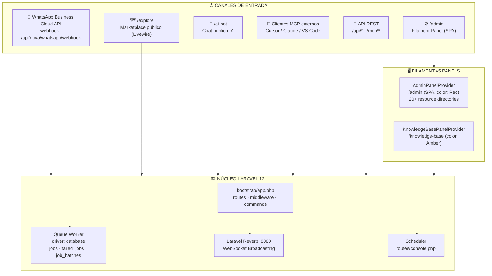


---

## 2. Capa MCP — Hub de Servidores

```mermaid
graph LR
    subgraph NOVA_MCP_SERVER["🟢 NOVA como SERVIDOR MCP"]
        MCPGen["McpServerGenerator\nlee tabla servers DB\nregistra handlers dinámicos"]
        DynServer["DynamicServer\nDynamicTool\nDynamicResource\nDynamicPrompt"]
        MCPEndpoint["Endpoints:\n/mcp/nova/*\n/api/mcp/*"]
        MCPGen --> DynServer --> MCPEndpoint
    end

    subgraph NOVA_MCP_CLIENT["🔵 NOVA como CLIENTE MCP"]
        direction TB
        LB["laravel-boost\nphp artisan boost:mcp\n(docs dev)"]
        FIL["filamentphp\nnpx filamentphp-mcp\n(docs Filament)"]
        TW["tinkerwell\nbinario local ARM64\n(PHP REPL)"]
        TAXIWP["taxilanz-wordpress\nmcp-remote → taxilanzwp7.test\n(WP con Basic Auth)"]
        SIRVO["sirvo\nhttp://192.168.1.50:3000\n(restaurante LAN)"]
        MAG["magento2\nNode.js mcp-server.js\n(Lanzaloe Magento)"]
        WPSTUDIO["wordpress-studio\nstudio mcp"]
        HERD["herd\nherd-mcp.phar\n(Laravel Herd)"]
        LAGERIA["www-lageria-com\nhttps://lageria.com/wp-json/mcp/v1/http\n(Bearer token)"]
        CTX7["context7\nnpx @upstash/context7-mcp\n(docs contexto)"]
        TBPLUS["tableplus\nTablePlus.app MCP\n(DB GUI)"]
        ERASER["eraser\nhttps://app.eraser.io/api/mcp\n(diagramas)"]
        MIRO["miro-mcp\nhttps://mcp.miro.com/\n(boards)"]
        FLOWBITE["flowbite\nnpx flowbite-mcp\n(UI docs)"]
        FILEXAMPLES["filament-examples\nhttps://filamentexamples.com/mcp\n(ejemplos)"]
    end

    MCPEndpoint --> NOVA_MCP_CLIENT
    TAXIHOTELES["taxilanz-hoteles\nhttps://novahubmcp.test/api/mcp/\n(self-ref)"] --> MCPEndpoint
```


---

## 3. Capa de Inteligencia Artificial

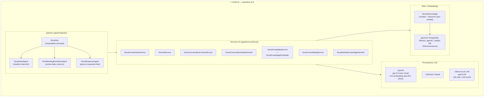


---

## 4. Modelo de Datos — NovaBusiness como raíz

```mermaid
erDiagram
    NovaBusiness ||--o{ NovaService : "has"
    NovaBusiness ||--o{ Server : "owns (MCP)"
    NovaBusiness ||--o{ NovaAiProfile : "has"
    NovaBusiness ||--o{ NovaAiKnowledge : "has"
    NovaBusiness ||--o{ NovaWhatsappChannel : "has"
    NovaBusiness ||--o{ NovaIntentRule : "has"
    NovaBusiness ||--o{ NovaCrossSellingRule : "has"
    NovaBusiness ||--o{ NovaListingCategory : "has"
    NovaBusiness ||--o{ NovaIntegrationSetting : "has"
    NovaBusiness ||--o{ NovaIntegrationSyncLog : "has"
    NovaBusiness ||--o{ NovaExternalBooking : "has"
    NovaBusiness ||--o{ NovaExternalOrder : "has"
    NovaBusiness ||--o{ NovaExternalTransaction : "has"
    NovaBusiness ||--o{ NovaExternalCatalogItem : "has"
    NovaBusiness ||--o{ NovaExternalCustomer : "has"
    NovaBusiness ||--o{ NovaRequest : "has"
    NovaBusiness ||--o{ NovaModule : "has"

    Server ||--o{ Tool : "has"
    Server ||--o{ Resource : "has"
    Server ||--o{ Prompt : "has"
    Server ||--o{ McpLog : "logs"

    NovaWhatsappChannel ||--o{ NovaWhatsappMessage : "has"
    NovaIntentToServerMapping }o--|| Server : "maps to"

    User ||--o{ TaxiBooking : "creates"
    User ||--o{ TourBooking : "creates"
    User ||--o{ HotelBooking : "creates"
    User ||--o{ RestaurantBooking : "creates"
    User ||--o{ RentalBooking : "creates"

    TaxiBooking ||--o{ Payment : "has"
    TaxiBooking ||--|{ Driver : "assigned"
    TaxiBooking ||--|{ Vehicle : "uses"

    Factura ||--o{ RegistroFactura : "has"
    Cliente ||--o{ Factura : "has"
    Empresa ||--o{ Factura : "has"

    Workflow ||--o{ WorkflowAuditLog : "logs"
    AgentConversation ||--o{ NovaRequest : "linked"
```


---

## 5. Flujo Completo — WhatsApp → IA → Reserva → Pago

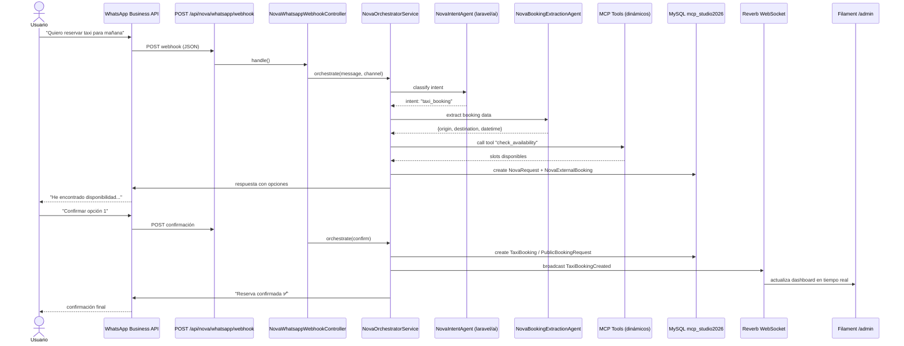


---

## 6. Integraciones Externas — Sincronización

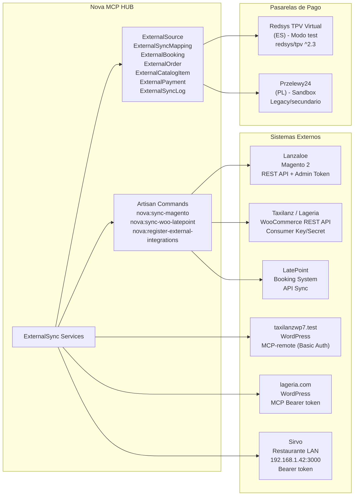


---

## 7. Stack de Servicios — Capas internas

```mermaid
graph TB
    subgraph HTTP["HTTP Layer"]
        CTRL["Controllers\nApi/ · MapController\nRedsysController · VoiceController\nMCPController · PanelBuilderController"]
        LW["Livewire Components\nTourist/ · Providers/\nIntegratedPanelManager\nWorkflowPanelManager\nReactFlowEditor"]
        VOLT["Volt Single-File\nfacturacion/* · test"]
    end

    subgraph SVC["Services Layer (app/Services/)"]
        direction LR
        SVC_AI["AI/\nOrchestration"]
        SVC_NOVA["Nova/\n19 servicios:\nOrchestratorService\nWhatsAppCloudService\nMcpClient\nKnowledgeEmbedder\nMagentoApiSync\nWooCommerceApiSync\nLatePointApiSync\nSirvoReservationClient\n..."]
        SVC_TAXI["TaxiBooking/\nTaxiService/\nTrip/\nDriver/\nVehicle/"]
        SVC_BOOK["Bookings/\nRental/\nCancellation/\nRating/"]
        SVC_PAY["Payments/\nPricing/\nRedsys · Przelewy24"]
        SVC_EXT["ExternalSync/\nMCP/"]
        SVC_GEO["GeoapifyService\nGeocodingService\nGpsTrackingService"]
        SVC_MISC["McpServerGenerator\nToolExecutor\nSchemaBuilder\nCodeGeneratorService\nRecommendationEngine\nSlotService\nSpeechAnalysisService"]
    end

    subgraph DOMAIN["Domain Models (app/Models/)"]
        DOM_NOVA["Nova domain\nNovaBusiness · NovaService\nNovaAiProfile · NovaAiKnowledge\nNovaWhatsappChannel/Message\nNovaIntentRule · NovaCrossSellingRule\nNovaIntentToServerMapping\nNovaRequest · NovaModule"]
        DOM_MCP["MCP domain\nServer · Tool · Resource\nPrompt · McpLog"]
        DOM_TAXI["Taxi domain\nTaxiService · TaxiBooking\nDriver · Vehicle · VehicleType\nTrip · Ride · TransferTariff"]
        DOM_TOUR["Tourism domain\nTour · TourBooking · TourSchedule\nHotel · HotelBooking · RoomType\nRestaurant · RestaurantBooking\nRental · RentalBooking · RentalVehicle"]
        DOM_EXT["External Sync\nExternalSource · ExternalBooking\nExternalOrder · ExternalPayment\nExternalCatalogItem · ExternalSyncLog"]
        DOM_BILL["Facturación\nFactura · RegistroFactura\nCliente · Empresa · Concepto"]
        DOM_WFLOW["Workflow\nWorkflow · WorkflowAuditLog\nAgentConversation"]
        DOM_PANEL["Panel Builder\nPanel · PanelField\nPanelRelation · PanelTable\nBuilderSchema"]
    end

    HTTP --> SVC
    SVC --> DOMAIN
```


---

## 8. Broadcasting — Eventos en Tiempo Real

```mermaid
graph LR
    subgraph EVENTS["Events (app/Events/) — ShouldBroadcast"]
        direction TB
        E1["TaxiBookingCreated\nTaxiBookingUpdated\nTaxiBookingDeleted\nTaxiBookingStatusUpdated\nTaxiBookingDriverAssigned\nTaxiBookingVehicleAssigned\nTaxiServiceUpdated"]
        E2["TripCreated\nTripRequested\nTripStatusChanged\nTripCancelled"]
        E3["DriverLocationUpdated\nDriverAvailabilityChanged"]
        E4["VehicleCreated\nVehicleUpdated\nVehicleTypeUpdated"]
    end

    subgraph CHANNELS["Canales Privados"]
        CH1["taxi-bookings.{id}"]
        CH2["user.{userId}"]
        CH3["App.Models.User.{id}"]
    end

    subgraph REVERB_SRV["Laravel Reverb"]
        RBSRV["WebSocket Server :8080\nTLS-ready\nScaling: Redis (desactivado)\nDev mode: log driver"]
    end

    subgraph LISTENERS["Listeners Frontend"]
        LW_DASH["Livewire Dashboard\nFilament Widgets\nRealtime updates"]
        TAXI_MAP["Mapa taxi\nGPS tracking live"]
    end

    EVENTS --> CHANNELS
    CHANNELS --> REVERB_SRV
    REVERB_SRV --> LISTENERS
```


---

## 9. Panel Filament — Recursos y Páginas

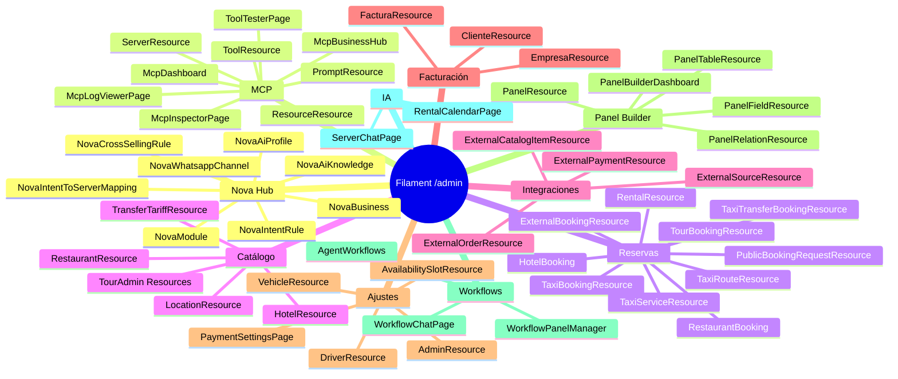


---

## 10. Frontend Stack

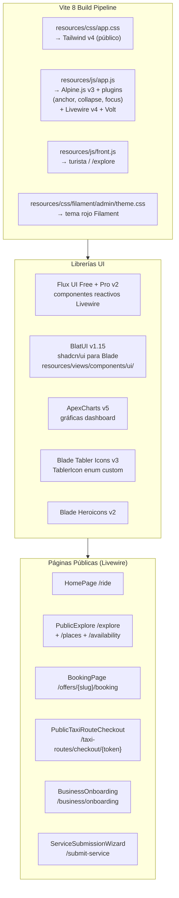


---

## 11. Infraestructura Local y Entorno

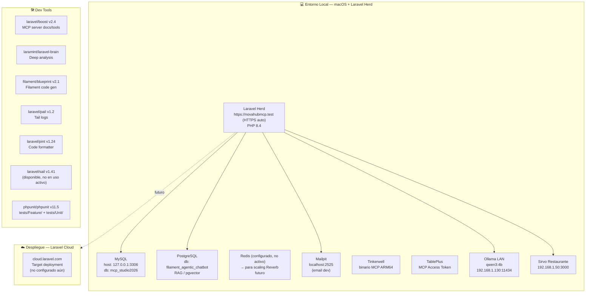


---

## 12. Artisan Commands — Mapa de Operaciones

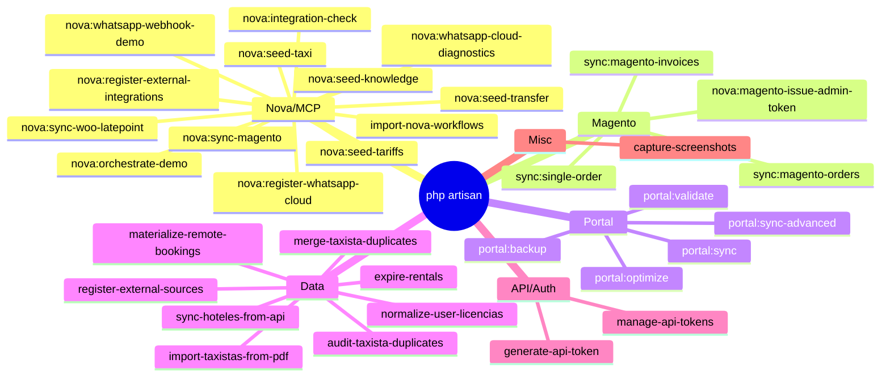


---

## 13. Diagrama C4 — Visión de Alto Nivel (Eraser.io compatible)

```
// Pega este código en https://app.eraser.io → New Diagram → Cloud Architecture

title Nova MCP HUB — System Architecture

// External Users
User [icon: user, color: blue]
BusinessOwner [icon: user, color: green]
AIAgent [icon: cpu, color: purple] {
  Cursor
  ClaudeDesktop
  VSCode
}

// Entry Points
WhatsApp [icon: message-square, color: green]
PublicWeb [icon: globe, color: blue] {
  "/explore marketplace"
  "/ai-bot chat"
  "/ride taxi"
}

// Nova Core
NovaHub [icon: server, color: red] {
  Laravel12 [icon: code, color: red] {
    FilamentAdmin [icon: layout, color: red]
    LivewireVolt [icon: zap, color: orange]
    LaravelAI [icon: cpu, color: purple]
    LaravelMCP [icon: link, color: blue]
    LaravelReverb [icon: radio, color: yellow]
    QueueWorker [icon: layers, color: gray]
  }
  MySQL [icon: database, color: blue]
  PostgreSQL_pgvector [icon: database, color: teal]
}

// MCP Servers Connected
MCPNetwork [icon: network, color: purple] {
  laravel_boost [icon: tool]
  filamentphp_mcp [icon: tool]
  tinkerwell [icon: tool]
  taxilanz_wordpress [icon: wordpress]
  lageria_wordpress [icon: wordpress]
  magento2_lanzaloe [icon: shopping-cart]
  sirvo_restaurant [icon: coffee]
  context7_docs [icon: book]
  eraser_diagrams [icon: pen-tool]
  miro_boards [icon: trello]
  tableplus_db [icon: database]
}

// External Systems
ExternalPlatforms [icon: cloud, color: orange] {
  WooCommerce [icon: shopping-cart]
  LatePoint [icon: calendar]
  Magento2 [icon: shopping-bag]
  WordPressMultisite [icon: globe]
}

// Payment Gateways
Payments [icon: credit-card, color: green] {
  Redsys_TPV [icon: credit-card]
  Przelewy24 [icon: credit-card]
}

// AI Providers
AIProviders [icon: cpu, color: purple] {
  OpenAI [icon: zap]
  Anthropic [icon: cpu]
  Ollama_Local [icon: server]
}

// Connections
User --> WhatsApp
User --> PublicWeb
BusinessOwner --> NovaHub.Laravel12.FilamentAdmin
AIAgent --> NovaHub.Laravel12.LaravelMCP

WhatsApp --> NovaHub
PublicWeb --> NovaHub

NovaHub.Laravel12.LaravelMCP --> MCPNetwork
NovaHub.Laravel12.LaravelAI --> AIProviders
NovaHub.Laravel12.LaravelReverb --> User : "WebSocket realtime"
NovaHub --> ExternalPlatforms : "sync bidireccional"
NovaHub --> Payments : "checkout"
NovaHub --> NovaHub.MySQL
NovaHub --> NovaHub.PostgreSQL_pgvector : "RAG embeddings"
```


---

## 14. Resumen — Inventario de Componentes

| Capa | Tecnología | Detalle |
|------|-----------|---------|
| **Framework** | Laravel 12 / PHP 8.4 | bootstrap/app.php streamlined |
| **Admin UI** | Filament v5 | SPA, 20+ directorios de recursos, 2 paneles |
| **Frontend** | Livewire v4 + Volt + Flux UI Pro + BlatUI | Vite 8, Tailwind v4, Alpine.js v3 |
| **MCP Server** | laravel/mcp v0.7 | Servers dinámicos desde DB, DynamicTool/Resource/Prompt |
| **MCP Client** | 15 servidores externos | Tinkerwell, Filament, Magento, WP, Sirvo, Eraser, Miro... |
| **IA / Agents** | laravel/ai v0.6 | 4 agentes: Hub, Intent, BookingExtraction, Response |
| **LLMs** | OpenAI + Anthropic + Ollama | GPT-3.5-turbo, Claude, qwen3:4b local LAN |
| **RAG** | pgvector (PostgreSQL) | 1536 dims, NovaAiKnowledge con auto-embed Observer |
| **WhatsApp** | Meta Cloud API | webhook verify+receive, transcripción de audio |
| **Broadcasting** | Laravel Reverb :8080 | 16 eventos broadcast, canales privados, TLS-ready |
| **Queue** | Database driver | jobs, failed_jobs, job_batches en MySQL |
| **Pagos** | Redsys TPV (ES) + Przelewy24 (PL) | test/sandbox mode |
| **Sync Externo** | Magento2, WooCommerce, LatePoint, WordPress | REST APIs + MCP-remote |
| **Geo** | Geoapify | geocoding, routing, places, transfer-route |
| **DB principal** | MySQL · mcp_studio2026 | 150+ migraciones, 100+ modelos |
| **DB RAG** | PostgreSQL · filament_agentic_chatbot | pgvector |
| **Serving local** | Laravel Herd | https://novahubmcp.test (HTTPS auto) |
| **Deploy target** | Laravel Cloud | pendiente de configurar |
| **Testing** | PHPUnit v11 | tests/Feature/ + tests/Unit/ |
| **Code style** | Laravel Pint v1.24 | --dirty --format agent |
| **Dev tools** | laravel/boost, filament/blueprint, laravel-brain | MCP-powered |

---

*Archivo generado automáticamente. Actualizar con cada cambio estructural significativo.*

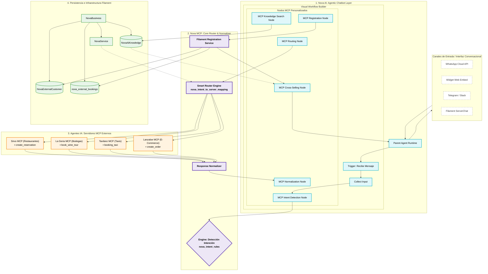

Análisis del Flujo de Información en el Gráfico:Abstracción del Canal (Capa Blanca): Cualquier interacción (WhatsApp, Widget, etc.) es interceptada por el runtime del Parent Agent. Los canales no tocan el código de negocio.Lienzo Visual No-Code (Capa Celeste): El flujo avanza de forma secuencial a través de los Nodos MCP Personalizados. Esta capa es la encargada de dictar la lógica humana del flujo (ej. pedir datos faltantes antes de enviar la petición).El Cerebro Normalizador (Capa Morada): El nodo de enrutamiento delega en Nova MCP. Este bloque es el único que traduce los parámetros del bot hacia los servidores externos y viceversa. Los servidores como Sirvo MCP o Taxilanz MCP devuelven JSON puros que el Response Normalizer transforma para que encajen limpiamente en nova_external_bookings.La Raíz Relacional (Capa Verde): Muestra visualmente el principio del modelo: todo cuelga y depende de NovaBusiness, mapeando dinámicamente sus servicios, sus clientes externos unificados y su base de conocimiento indexada.Para materializar esta infraestructura visual en tu panel de administración, dime:¿Quieres que diseñemos la estructura de migración en Laravel / Filament para la tabla nova_mcp_servers que incluya las columnas de capabilities, transport e instructions?¿Te gustaría ver el código de ejemplo en PHP de cómo NovaResponseNormalizer mapearía una respuesta cruda de Sirvo MCP a la tabla estructurada nova_external_bookings?

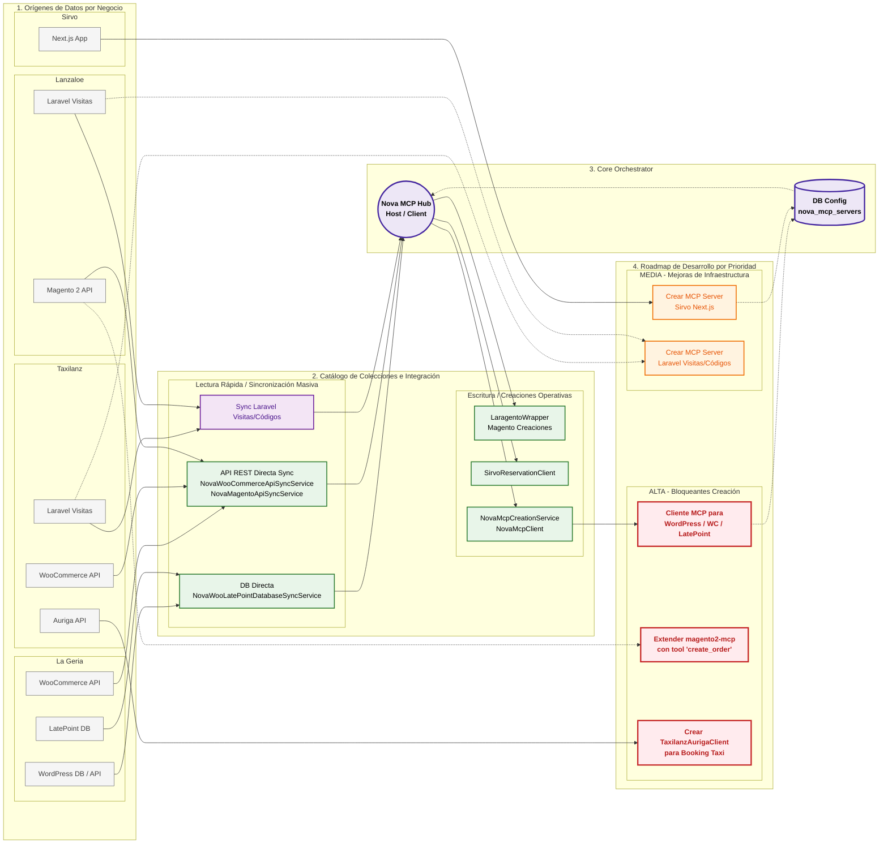

